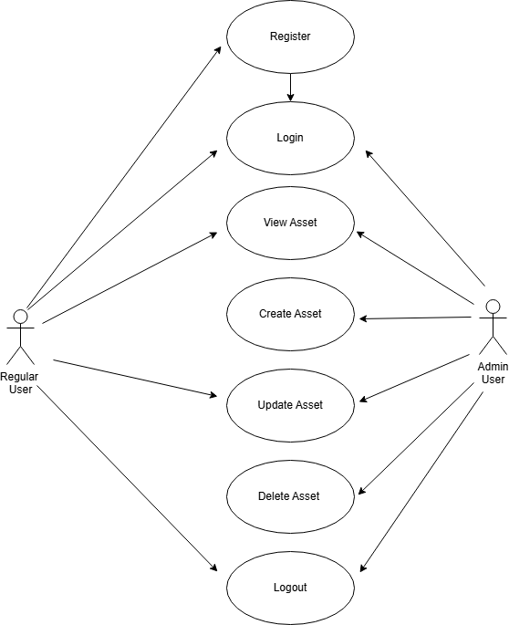

# Asset Manager Web Application

## Summary
The Asset Manager is a web-based application designed to help organisations efficiently track and manage their IT assets. It provides a user-friendly interface for creating, updating, and viewing asset information.

## URL
The Asset Manager application can be accessed using the following link:

**Please note it may take over a minute for the instance to spin up before being able to login.**

https://asset-manager-msfh.onrender.com

## Login Details
- **Admin:** 

    Username - admin

    Password - adminpass

- **Regular User**

    Username - user  

    Password - userpass

## Features
- **Asset Management:** Easily create, read, update, and delete asset records.
- **User Roles:** Supports two user roles - admin and regular user - each with specific permissions.
- **User Authentication:** Users must register and log in to access the application.
- **Dashboard:** A clean and intuitive dashboard provides an overview of assets.
- **Responsive Design:** The application is responsive and works on various devices.

    

## User Roles
- **Admin:** Administrators can perform all CRUD operations on IT assets, including creating, viewing, updating, and deleting records.
- **Regular User:** Regular users can view and update existing assets.

## Database Schema

- **Asset:** Stores information about IT assets including name and description.
  
            Attributes: 'id (PK, FK)', 'name', 'description', 'date_created', 'created_by', 'owner_id'

- **User:** Stores information about the user.

            Attributes: 'id (PK)', 'username', 'password', 'role'
